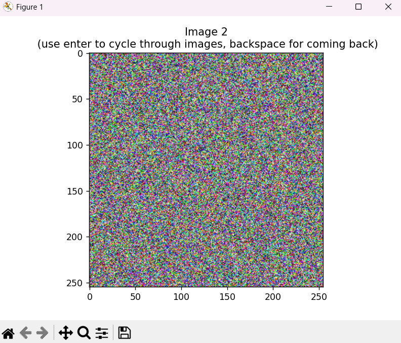

# Random Image Generator & Browser

This simple Python script lets you generate random images of a custom size and then browse through them interactively. You can create new images, navigate through your history, and save your favorites as PNG files.

### PROBABILITY
when you make image sized 64x64 there are 68719476736 possible combinations
-   `256 x 256 x 256 x 64 x 64 = 68,719,476,736`
- and the chance to get specific image is one to `68,719,476,736`
in conclusion there is chance 1:68 719 476 736 to generate your face if you make 64x64 image

## Features

* **Custom Dimensions:** Specify the width and height for your random images at startup.
* **On-the-Fly Generation:** Press the **`Enter`** key to generate and display a new random image, which is then added to your Browse history.
* **Browse History:** Move back and forth through previously generated images using the **`Enter`** (next/new) and **`Backspace`** (previous) keys.
* **Save Images:** Save any currently displayed image as a PNG file.


## Example
- This is generated image with size 255x255


## Getting Started


Follow these steps to get the image generator up and running on your machine.

### Prerequisites

You'll need Python installed. This project specifically relies on the `numpy` and `matplotlib` libraries.

first clone the project

```bash
git clone https://github.com/KR3915/Random-image-generator.git
```
then you can install requirements using pip 
```bash
pip install -r requirements.txt
```
run the project
```bash
python '.\image generator.py'
```
enter the width and height
```bash
Enter width: your width
Enter height: your height
```


